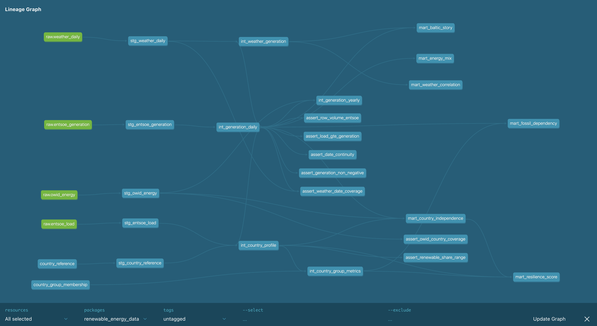

# Renewable Energy Analytics Pipeline

**Anna Petrovska** · [github.com/apetrovska](https://github.com/apetrovska) · 2026

`Python` `dbt Core` `Apache Airflow` `BigQuery` `Docker` `Snowflake` `Looker Studio` `GitHub Actions`

---

## Overview

End-to-end data pipeline tracking European renewable energy generation across 11 countries (2023-2025). Built to demonstrate production-grade dbt and Airflow patterns on real public data.

The pipeline ingests hourly generation data from ENTSO-E, daily weather from Open-Meteo, and yearly capacity statistics from Our World in Data - transforming them through a layered dbt architecture into analytical marts that answer specific policy questions about Europe's energy transition.

**Status: in active development.** Ingestion, dbt transformation, and Airflow orchestration are complete. Data quality tests - in development. Looker Studio dashboard and Snowflake migration TBD.

---

## What This Pipeline Answers

1. Which countries lead Europe's renewable transition, and how has that changed 2023–2025?
2. How strongly does weather (wind speed, sunshine hours) predict actual renewable generation?
3. Where and when does fossil fuel dependency peak - and which countries carry the most exposure?
4. Which countries are closest to full renewable independence? What's blocking the rest?
5. What measurably changed for Estonia, Latvia, and Lithuania after the BRELL grid exit in February 2025?

---

## Architecture

```
ENTSO-E API ──┐
              ├──→ raw (BigQuery) ──→ staging ──→ intermediate ──→ marts ──→ Looker Studio
Open-Meteo ───┤
              │         dbt Core (transformation)
OWID CSV ─────┘

Apache Airflow (orchestration)
├── energy_pipeline_daily   07:00 UTC - ENTSO-E + weather + dbt run
└── energy_pipeline_weekly  06:00 UTC Sunday - OWID refresh
```

### Data Sources

| Source | Data | Granularity | Refresh | Extractor |
|--------|------|-------------|---------|-----------|
| [ENTSO-E](https://transparency.entsoe.eu/) | Electricity generation by type + load | Hourly | Daily | `entsoe_extractor.py` |
| [Open-Meteo](https://open-meteo.com/) | Weather (wind, sunshine, temp, precip) by country capital | Daily | Daily | `weather_extractor.py` |
| [Our World in Data](https://github.com/owid/energy-data) | Renewable capacity, CO2 intensity | Yearly | Weekly | `owid_extractor.py` |

**Open-Meteo Note:** Weather extraction fetches daily data from Open-Meteo archive API with 3-second rate limiting between country requests and error resilience (skips failed countries, continues with others).

### Countries

11 countries across three analytical dimensions:

| Group | Countries |
|-------|-----------|
| Core | DE, FR, ES, PL, AT, HU |
| Geopolitical | NO, SK, LT |
| Baltic Synchronization | EE, LV, LT |

Lithuania belongs to both Geopolitical and Baltic groups - modeled as a many-to-many seed table.

---

## dbt Model Structure



```
staging/
  stg_entsoe_generation     type-cast, standardize production type names
  stg_entsoe_load           type-cast load data
  stg_weather_daily         type-cast, sunshine seconds → hours
  stg_owid_energy           filter to 11 countries + 2020-2025
  stg_country_reference     seed-backed country metadata

intermediate/
  int_generation_daily      hourly → daily, energy_category, season  [incremental]
  int_generation_yearly     daily → yearly, join with OWID
  int_weather_generation    join generation + weather, z-score anomaly detection  [incremental]
  int_country_profile       renewable_share, fossil_dependency, total_load
  int_country_group_metrics all window functions: group avg, delta, rank

marts/
  mart_energy_mix           energy mix by country and month, YoY change
  mart_weather_correlation  weather vs generation correlation, anomaly overlay
  mart_country_independence self-sufficiency score, days above 80% renewable
  mart_fossil_dependency    fossil exposure by country and month
  mart_resilience_score     composite resilience score
  mart_baltic_story         pre/post Feb 2025 comparison for EE, LV, LT
```

**Key design decisions:**

- Incremental models on `int_generation_daily` and `int_weather_generation` with a 3-day lookback window to catch ENTSO-E late corrections
- All window functions centralized in `int_country_group_metrics` - marts are pure SELECTs
- Z-score anomaly detection uses a 90-day rolling window per country
- Season computed once in `int_generation_daily`, reused downstream

---

## Orchestration

Two Airflow DAGs with different cadences and failure modes:

**`energy_pipeline_daily`** (07:00 UTC)
```
extract_entsoe ──┐
                 ├──→ load_to_raw → dbt seed → dbt source freshness → dbt run → dbt test
extract_weather ─┘                                                                        ↘ notify_on_failure
```

**`energy_pipeline_weekly`** (Sunday 06:00 UTC)
```
extract_owid → load_raw_owid (WRITE_TRUNCATE) → notify_on_failure
```

`dbt source freshness` runs as a fail-fast gate - stale data never enters transformation.

---

## Data Quality

48 schema tests + 7 custom domain tests covering four layers:

| Test | What it checks | Severity |
|------|----------------|----------|
| `assert_generation_non_negative` | generation_mwh >= 0 | error |
| `assert_renewable_share_range` | renewable_pct BETWEEN 0 AND 100 | error |
| `assert_load_gte_generation` | flags unexpected generation > load | warn |
| `assert_row_volume_entsoe` | COUNT(*) >= 200 per country per day | error |
| `assert_weather_date_coverage` | weather exists for every generation date | warn |
| `assert_date_continuity` | no gaps in daily dates per country | warn |
| `assert_owid_country_coverage` | all 11 countries present per year | error |

---

## Dependencies

### Core Libraries

| Package | Version | Purpose |
|---------|---------|---------|
| `pandas` | ≥2.0.0 | Data transformation and manipulation |
| `requests` | ≥2.31.0 | HTTP requests (Open-Meteo, OWID) |
| `entsoe-py` | ≥0.6.0 | ENTSO-E Transparency API client |
| `google-cloud-bigquery` | ≥3.0.0 | BigQuery integration |
| `google-cloud-bigquery-storage` | ≥2.0.0 | BigQuery Storage API (fast reads) |
| `pyarrow` | ≥12.0.0 | Parquet support for BigQuery |

### Installation

```bash
pip install -r requirements.txt
```

**Note:** All dependencies are production-ready with no optional features. The extractors use industry-standard libraries: `requests` for HTTP, `entsoe-py` for ENTSO-E API, and `google-cloud-bigquery` for data warehousing.

---

## Local Setup

### Prerequisites

- Docker Desktop
- GCP service account with BigQuery access
- ENTSO-E API key ([request here](https://transparency.entsoe.eu/))

### Run

```bash
# Clone
git clone https://github.com/apetrovska/renewable-energy-data.git
cd renewable-energy-data

# Add credentials
cp .env.example .env
# Edit .env: add ENTSOE_API_KEY
# Add GCP service account key as renewable-energy-data-key.json

# Start Airflow
docker compose up airflow-init
docker compose up -d

# Open UI
open http://localhost:8080
# Login: airflow / airflow
```

### dbt only (without Docker)

```bash
cd dbt
dbt seed --target dev
dbt run --target dev --full-refresh
dbt test --target dev
```

> **Note:** `--full-refresh` is required in BigQuery sandbox (free tier does not support DML). In a billed environment, incremental models run as designed.

---

## Repository Structure

```
renewable-energy-data/
├── dags/
│   ├── energy_pipeline_daily.py
│   └── energy_pipeline_weekly.py
├── dbt/
│   ├── models/
│   │   ├── staging/
│   │   ├── intermediate/
│   │   └── marts/
│   ├── seeds/
│   │   ├── country_reference.csv
│   │   └── country_group_membership.csv
│   ├── tests/
│   └── sources.yml
├── ingestion/
│   ├── entsoe_extractor.py
│   ├── weather_extractor.py
│   ├── owid_extractor.py
│   └── load_to_raw.py
├── Dockerfile
├── docker-compose.yml
└── README.md
```

---

## Known Limitations

| Limitation | Detail |
|------------|--------|
| Weather coordinates are capital cities | Not actual generation sites. Standard approximation for country-level analysis. Affects correlation precision, not direction. |
| Incremental models use `--full-refresh` in sandbox | BigQuery free tier does not support DML (MERGE). Incremental logic is preserved in code; `--full-refresh` used in DAG. In a billed environment, models run as true incrementals. |
| EE and LV pre-2025 data may be incomplete | Before BRELL synchronization (Feb 2025), Estonia and Latvia were on a separate grid. ENTSO-E coverage for this period may have gaps. |
| Norway has no EU 2030 target | `eu_target_2030_pct` is NULL for NO (EEA, not EU). Handled via NULLIF in SQL. |
| ENTSO-E 3-day correction buffer | ENTSO-E retroactively corrects recently published data. Incremental models reprocess the last 3 days on every run. |

---

## Roadmap

- [ ] Data quality tests
- [ ] Full 3-year historical backfill (2023–2025) for all 11 countries
- [ ] Looker Studio dashboard
- [ ] GitHub Actions CI/CD
- [ ] Snowflake mart migration (Phase 2)
